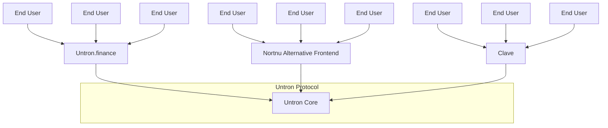

# Untron Core in one breath

Now, let's clean up some accumulated confusion about what Untron Core does and how it works.

Untron Core is a smart contract that manages peer-to-peer (P2P) orders between USDT on Tron and its native chain—in our case, ZKsync Era. The orders are P2P because technically people buy and sell USDT for USDT from each other, just on the different chains. To verify the fact of USDT transfer on Tron network, Untron Core utilizes ZK proofs of Untron Program.

## Order Workflow in Untron Core

> **Warning**: This diagram is slightly simplified and must not be used for reimplementation or logic auditing.

```mermaid
flowchart TD
    A[Start: Order Creator Wants to Swap USDT Tron to USDT L2]

    %% Step 1: Order Creator Initiates an Order
    A --> B[Order Creator Calls createOrder]

    %% Step 2: Collect Collateral
    B --> C[Collect requiredCollateral from Order Creator]

    %% Step 3: Validate Receiver Availability
    C --> D{Is Receiver Busy?}

    %% If Receiver is Busy
    D -->|Yes| E{Is Existing Order Expired?}
    E -->|Yes| F[Free the Receiver]
    E -->|No| G[Revert: Receiver is busy]
    G --> H[End]

    %% If Receiver is Not Busy
    D -->|No| I[Proceed to Validate Receiver Ownership]

    %% Step 4: Validate Receiver Ownership
    F --> I
    I --> J{Is Receiver Owned by Provider?}
    J -->|Yes| K[Proceed to Validate Provider's Liquidity]
    J -->|No| L[Revert: Receiver is not owned by provider]
    L --> H

    %% Step 5: Validate Provider's Liquidity
    K --> M{Does Provider Have Sufficient Liquidity?}
    M -->|Yes| N[Proceed to Validate Rate Consistency]
    M -->|No| O[Revert: Provider does not have enough liquidity]
    O --> H

    %% Step 6: Validate Rate Consistency
    N --> P{Does Rate Match Provider's Rate?}
    P -->|Yes| Q[Proceed to Validate Order Size]
    P -->|No| R[Revert: Rate does not match provider's rate]
    R --> H

    %% Step 7: Validate Order Size
    Q --> S{Is Order Size Within Provider's Min and Max Limits?}
    S -->|Yes| T[Deduct Provider's Liquidity]
    S -->|No| U[Revert: Order size is out of bounds]
    U --> H

    %% Step 8: Deduct Provider's Liquidity
    T --> V[Update Provider's Liquidity Balance]

    %% Step 9: Update Action Chain and Order State
    V --> W[Update Action Chain]
    W --> X[Mark Receiver as Busy]
    X --> Y[Store Order Details]
    Y --> Z[Emit OrderCreated Event]

    %% Option to Modify or Stop Order
    Z --> AA{Does Order Creator Want to Modify or Stop Order?}
    AA -->|Yes| AB{Modify or Stop?}
    AB -->|Modify| AC[Call changeOrder]
    AC --> AD{Is Caller the Order Creator and Order Unfulfilled?}
    AD -->|Yes| AE[Update Order Transfer Details]
    AD -->|No| AF[Revert: Only creator can change the order]
    AF --> H

    AB -->|Stop| AG[Call stopOrder]
    AG --> AH{Is Caller the Order Creator and Order Unfulfilled?}
    AH -->|Yes| AI[Proceed to Stop Order]
    AH -->|No| AJ[Revert: Only creator can stop the order]
    AJ --> H

    %% Stopping an Order
    AI --> AK[Update Action Chain to Reflect Stop Action]
    AK --> AL[Refund Provider's Liquidity]
    AL --> AM[Refund Order Creator's Collateral]
    AM --> AN[Delete Order]
    AN --> AO[Emit OrderStopped Event]
    AO --> H

    %% If No Modification or Stopping
    AA -->|No| AP[Order Remains Active Until Fulfillment or Expiry]

    %% Step 10: Fulfiller Advances USDT L2
    AP --> AQ{Does a Fulfiller Decide to Fulfill the Order?}
    AQ -->|Yes| AR[Fulfiller Calls fulfill]
    AR --> AS[Collect Total Amount from Fulfiller]

    %% Step 11: Process Each Receiver's Order
    AS --> AT[For Each Receiver]
    AT --> AU[Retrieve Active Order]
    AU --> AV[Calculate Amount and Fee]
    AV --> AW[Update Expected Total]

    %% Step 12: Validate Fulfillment Amount
    AW --> AX{Is Total Amount >= Expected Total?}
    AX -->|Yes| AY[Proceed with Fulfillment]
    AX -->|No| AZ[Revert: Total does not match]
    AZ --> H

    %% Step 13: Perform Transfer to Order Creator
    AY --> BA[Perform Transfer via smartTransfer]
    BA --> BB[Refund Order Creator's Collateral]
    BB --> BC[Update Action Chain to Free Receiver]
    BC --> BD[Update Order to Reflect Fulfillment]
    BD --> BE[Emit OrderFulfilled Event]
    BE --> BF{Is There Excess Amount?}
    BF -->|Yes| BG[Refund Excess to Fulfiller]
    BG --> BH[Wait for ZK Proof Submission]
    BF -->|No| BH

    %% Step 14: ZK Proof Submission
    BH --> BI[Relayer Calls closeOrders with ZK Proof]
    BI --> BJ[Verify ZK Proof and Public Values]

    %% Step 15: Validate Proof
    BJ --> BK{Is Proof Valid and Public Values Match State?}
    BK -->|Yes| BL[Proceed to Process Closed Orders]
    BK -->|No| BM[Revert: Invalid proof or state mismatch]
    BM --> H

    %% Step 16: Update Global State
    BL --> BN[Update blockId, latestExecutedAction, stateHash]

    %% Step 17: Process Each Closed Order
    BN --> BO[For Each Closed Order]
    BO --> BP[Retrieve Order Details]
    BP --> BQ[Calculate minInflow]
    BQ --> BR[Calculate Amount and Fee]
    BR --> BS[Update Transfer Details]

    %% Step 18: Transfer Funds Based on Fulfillment Status
    BS --> BT{Was Order Fulfilled Earlier?}
    BT -->|Yes| BU[Transfer USDT L2 to Fulfiller]
    BT -->|No| BV[Transfer USDT L2 to Order Creator]

    %% Step 19: Handle Collateral
    BV --> BW{Did Order Creator Send USDT Tron?}
    BW -->|Yes| BX[Refund Collateral to Order Creator]
    BW -->|No| BY[Slash Collateral, Transfer to Contract Owner]
    BU --> BX

    %% Step 20: Release Receiver and Delete Order
    BX --> BZ[Release Receiver if Not Fulfilled]
    BY --> BZ
    BZ --> CA[Delete Order from Storage]
    CA --> CB[Emit OrderClosed Event]

    %% Step 21: Distribute Fees
    CB --> CC[Transfer Accumulated Fees to Owner]

    %% End
    CC --> H[End]
```



Untron Core natively supports swaps between USDT (used as liquidity) and other tokens through 1inch Aggregator, and cross-chain transfers of these tokens through Across Bridge. This way, as long as there's a way to initiate an _untron swap_ on ZKsync Era, users can untron into any token on virtually any chain of the Ethereum ecosystem.

```solidity
/// @notice The order creation function
/// @param provider The address of the liquidity provider owning the Tron receiver address.
/// @param receiver The address of the Tron receiver address
///                that's used to perform a USDT transfer on Tron.
/// @param size The maximum size of the order in USDT L2.
/// @param rate The "USDT L2 per 1 USDT Tron" rate of the order.
/// @param transfer The transfer details.
///                 They'll be used in the fulfill or closeOrders functions to send respective
///                 USDT L2 to the order creator or convert them into whatever the order creator wants to receive
///                 for their USDT Tron.
function createOrder(address provider, address receiver, uint256 size, uint256 rate, Transfer calldata transfer)
    external;
```

_(from [IUntronCore.sol](../contracts/src/interfaces/IUntronCore.sol))_

```solidity
/// @notice Struct representing a transfer.
struct Transfer {
    // recipient of the transfer
    address recipient;
    // destination chain ID of the transfer.
    // if not equal to the contract's chain ID, Across bridge will be used.
    uint256 chainId;
    // Across bridge fee. 0 in case of direct transfer.
    uint256 acrossFee;
    // whether to swap USDT to another token before sending to the recipient.
    bool doSwap;
    // address of the token to swap USDT to.
    address outToken;
    // minimum amount of output tokens to receive per 1 USDT L2.
    uint256 minOutputPerUSDT;
    // whether the minimum amount of output tokens is fixed.
    // if true, the order creator will receive exactly minOutputPerUSDT * amount of output tokens.
    // if false, the order creator will receive at least minOutputPerUSDT * amount of output tokens.
    bool fixedOutput;
    // data for the swap. Not used if doSwap is false.
    bytes swapData;
}
```

_(from [IUntronTransfers.sol](../contracts/src/interfaces/IUntronTransfers.sol))_

To prevent order spamming, Untron Core implements a collateral system, where each order creator is required to send a certain amount of collateral to the contract. This collateral is slashed and sent to the Core controller if the funds for the order were not sent to the receiver and the order wasn't stopped by the creator before expiration (5 minutes).

Untron team aims for the collateral size to be roughly equal to the opportunity cost of creating the order. That is, it's expected to be close to what all parties in the protocol would earn if the created order was properly executed.

```solidity
function requiredCollateral() external view returns (uint256);
```

_(from [IUntronCore.sol](../contracts/src/interfaces/IUntronCore.sol))_

### Untron is B2B or why collateral is a good UX

It's important to keep in mind that Untron is a B2B protocol. In other words, Untron _Core_ is not intended for end-users to interact with. Instead, various projects integrating Untron will provide necessary infrastructure for their users to interact with the protocol. For example, the project provides collateral itself and might decide to automatically stop all its unexecuted orders after 3 minutes, rather than 5, to keep their collateral.

The best, albeit not the most obvious, example of such integration is [Untron.finance](https://untron.finance)—the official frontend for Untron, built by Untron team. Untron.finance provides a straightforward interface to swap between USDT Tron from any wallet and chain without any collateral. Instead, it uses advanced internal logic to rate-limit dishonest users and prevent them from spamming orders. Therefore, from the technical point of view, Untron.finance is just one of the projects that utilizes Untron for its operations. If Untron.finance goes down, users can come to an alternative frontend, when such will be made, or use projects that integrate Untron directly—[Clave](https://getclave.com), [Daimo](https://daimo.com), [Peanut](https://peanut.to), and more—to perform swaps through them.



## Intron Swaps

_TODO: In the first iteration of Untron, Untron V1 was used to perform swaps in both sides. We implemented Untron Intents, a second, multi-chain protocol in the Untron ecosystem, that significantly improved UX for intron swaps. However, its documentation is still in progress. If you want to learn more about them now, please reach out to us._


