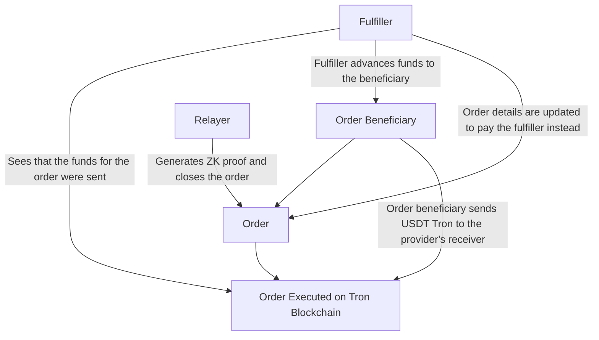
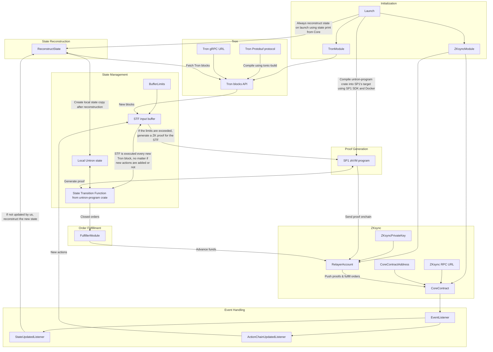

# How Untron works

Although seeming not obvious at all, we decided to start this deep dive into Untron protocol from its relayer software. Why? Well, Untron's relayer is, in fact, the thing that runs Untron. It's connected to all critical components of the protocol and orchestrates its operation. Therefore, we can start by explaining how the Relayer connects things you don't yet understand, and then move on to explaining those things.

Firstly, let's outline three main rules Untron relayer was built according to:

- Relayer is a starter. Therefore, all it must do is to start things that are already working properly when started;
- From this it follows that the Relayer must not be the source of trust—the worst thing it could do to the protocol is to go down and cause a liveness failure;
- To minimize the risk of and the damage from a potential liveness failure, the Relayer must be permissionless and relatively simple to run.

Simplifying, all the Relayer does is generate ZK proofs of the state transition function of Untron Protocol and sends them to the Core contract. This task is permissionless, and anyone can run the relayer, provided they can afford the cost of ZK proof generation.

## Relayers and Fulfillers

Besides relaying, relayer-the-crate implements a _Fulfiller_. Fulfillers advance funds for orders that were already executed (sent USDT Tron for), but this fact was not yet ZK proven onchain. If some order was _fulfilled_, it means that its beneficiary (could be order creator, but not necessarily; see later) has already received its ask on the destination chain after sending USDT Tron, but the Core contract doesn't yet know they did send it. This is because one of the Fulfillers had sent the ask in advance, after seeing that the transfer did indeed happen on Tron blockchain.

Fulfillers carry the risk of Tron blockchain's reorgs and must wait for the ZK proof to be verified to get their funds back, in exchange for a small fee. Similarly to relaying tasks, fulfillers are not the source of trust, and the worst that can happen if there are no fulfillers live is that the users will receive their funds in about 30 minutes rather than a few seconds. Considering the Tron blockchain has never reorged in its entire history, this risk is negligible.



## Relayer Software's Logic



Now, let's break it down step by step.

## Initialization

The relayer is initialized with a configuration file (`config.toml`), which contains the following parameters:

- `ethereum.rpc_url`: The URL of the ZKsync Era RPC node.
- `ethereum.private_key`: The private key of the relayer account on ZKsync Era network.
- `ethereum.core_address`: The address of the Untron Core contract on ZKsync Era network.
- `tron.rpc_url`: The URL of Tron gRPC node API.
- `buffer.max_blocks`: The maximum number of new Tron blocks to initiate ZK proof generation. 0 if no limit.
- `buffer.max_actions`: The maximum number of new Untron actions to initiate ZK proof generation. 0 if no limit.
- `buffer.min_interval`: The minimum interval between two consecutive ZK proof generations in seconds. 0 if no interval.

```toml
[ethereum]
rpc_url = "https://mainnet.era.zksync.io"
private_key = "0x1234567890123456789012345678901234567890123456789012345678901234"
core_address = "0x1234567890123456789012345678901234567890"

[tron]
rpc_url = "https://api.trongrid.io/jsonrpc"

[buffer]
max_blocks = 200
max_actions = 100
min_interval = 10
```

_An example configuration file._

## Build.rs

Before initializing all modules, the Relayer initiates an SP1 zkVM prover instance. It generates Groth16 ZK proofs of State Transition Function (STF) and sends them to the Core contract from the relayer's account. To initiate the prover, the Relayer compiles [untron-program](https://github.com/ultrasoundlabs/untron/tree/main/program) into SP1 zkVM target binary in Docker mode to ensure the ZK program is always the same given the same source code.

```rust
use sp1_build::{build_program_with_args, BuildArgs};
// Protobuf-related imports

fn main() -> Result<(), Box<dyn std::error::Error>> {
    // Protobuf compilation logic above

    println!("Building ZK program, make sure Docker is running...");

    let args = BuildArgs {
        docker: true,
        output_directory: "./elf".to_string(),
        ..Default::default()
    };
    build_program_with_args("../program", args);
    Ok(())
}
```

_(from [build.rs](https://github.com/ultrasoundlabs/untron/tree/main/relayer/build.rs))_

This compilation of untron-program should not be confused with constant calling of the State Transition Function from it. Besides compiling the program as an executable, the Relayer imports its STF as a dependency crate, getting rid of the overhead from initializing SP1 environment every Tron block.

```rust
tracing::info!("Executing state transition function...");

let _ = untron_program::stf(
    &mut state,
    Execution {
        actions: self.get_latest_actions().await?,
        blocks,
    },
);

tracing::info!("State transition function executed");
let state_hash = hash(&bincode::serialize(&state).unwrap());
tracing::info!("State hash: {:?}", hex::encode(state_hash));

let contract_state_hash = self.contract.state_hash().call().await?;
if state_hash != contract_state_hash {
    panic!(
        "State hash mismatch: {} != {}. This might be the case of Core's misconfiguration or a bug in the relayer. If you think it's the latter, please report it to the developers.",
        hex::encode(state_hash),
        hex::encode(contract_state_hash)
    );
}
```

_(from [main.rs](https://github.com/ultrasoundlabs/untron/tree/main/relayer/src/main.rs))_

Configuration values under `tron` are used to initiate **TronModule**. Besides the gRPC URL in it, **TronModule** requires compiled Tron Protobuf files to decode Tron transactions. They're compiled in [build.rs](https://github.com/ultrasoundlabs/untron/tree/main/relayer/build.rs) using [tonic-build](https://docs.rs/tonic-build/latest/tonic_build/) crate. Untron's repository [includes Tron Protocol as a git submodule](https://github.com/ultrasoundlabs/untron/tree/main/lib/java-tron/protocol/src/main/protos/), so it's necessary to initialize all submodules before building the Relayer.

```rust
// ZK-related imports
use std::fs;
use std::io;
use std::path::Path;

fn copy_dir_all(src: impl AsRef<Path>, dst: impl AsRef<Path>) -> io::Result<()> {
    fs::create_dir_all(&dst)?;
    for entry in fs::read_dir(src)? {
        let entry = entry?;
        let ty = entry.file_type()?;
        if ty.is_dir() {
            copy_dir_all(entry.path(), dst.as_ref().join(entry.file_name()))?;
        } else {
            fs::copy(entry.path(), dst.as_ref().join(entry.file_name()))?;
        }
    }
    Ok(())
}

fn main() -> Result<(), Box<dyn std::error::Error>> {
    println!(
        "Building Tron protocol... If it fails, make sure you initialized submodules in this repo."
    );

    copy_dir_all(
        Path::new("../lib/googleapis/google"),
        Path::new("../lib/java-tron/protocol/src/main/protos/google"),
    )?;
    tonic_build::configure()
        .build_server(false)
        .boxed("BlockExtention")
        .compile(
            &["../lib/java-tron/protocol/src/main/protos/api/api.proto"],
            &["../lib/java-tron/protocol/src/main/protos"],
        )?;
    fs::remove_dir_all("../lib/java-tron/protocol/src/main/protos/google")?;

    // ZK program compilation logic below
}

```

_(from [build.rs](https://github.com/ultrasoundlabs/untron/tree/main/relayer/build.rs))_
