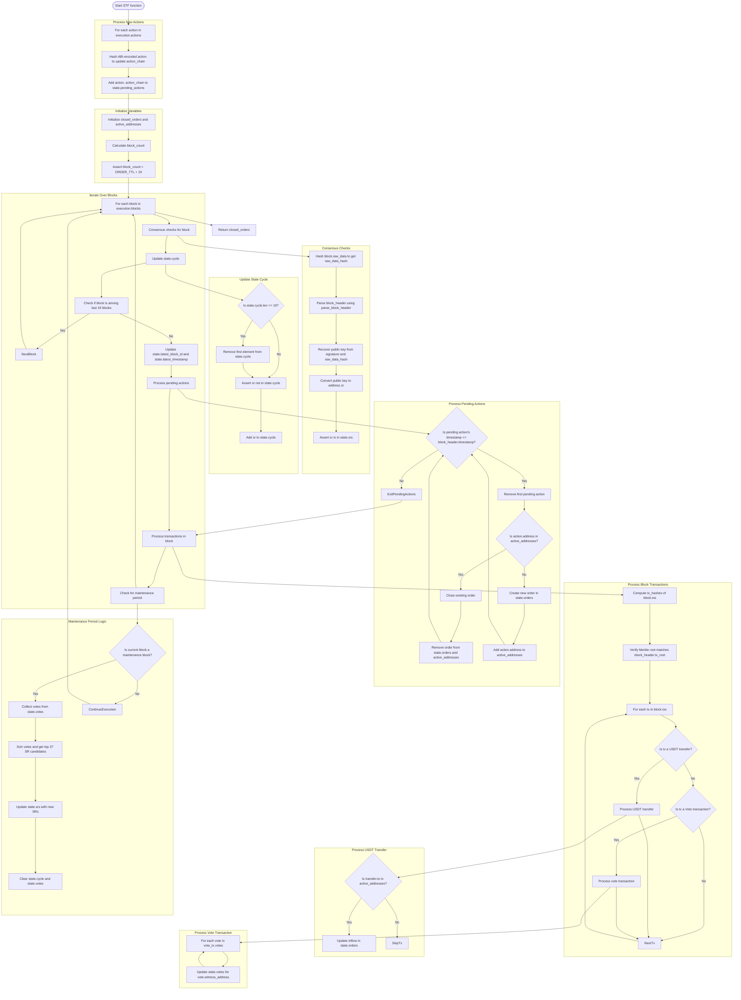

# Untron Program (State Transition Function)

The crucial part of Untron Protocol is its [ZK program](https://github.com/ultrasoundlabs/untron/tree/main/program/). It is responsible for reading all contents of Tron blocks and filtering out information relevant to orders in Untron Core.

In some sense, Untron's ZK program is a Rust rewrite of [Tron's node implementation](https://github.com/tronprotocol/java-tron), with light block verification and Untron-specific logic injected into it. Similarly to other node implementations, Untron Program includes its own state, needed to keep track of all orders and blocks in Tron blockchain, and the State Transition Function (STF). STF accepts the old state, a list of new _actions_ and blocks in Tron blockchain, and light-executes these blocks against the new orders to determine which orders were closed (that is, received required amount in USDT TRC20). It then commits to the new state and the list of orders that were closed.

Untron Program was implemented with ZK-friendliness in mind, so it's feasible to utilize Rust-based zkVMs to generate ZK proofs of its STF and easily verify them onchain. In our case, we utilize [SP1 zkVM](https://docs.succinct.xyz), but other zkVMs are possible to integrate as well. Generated ZK proofs are then sent to the Core contract for verification, and the respective orders are closed in the system. This way, we power trustless P2P exchange orders between Tron and other blockchains.



The program contains a large set of logic related to verifying the contents of Tron blocks and maintaining the state of the protocol. But, in short and simplifying, these are the main tasks the program performs:

- Maintaining the list of active Super-Representatives (SRs) who are authorized to propose new blocks;
- Accepting the list of pending actions from the Core contract and processing them respectively to timestamps of the blocks;
- Accepting new Tron blocks, performing the consensus checks for each of them;
- Iterating over all transactions in the block, finding USDT transfers related to the active orders in Core and storing updates (inflow) in the state;
- Closing orders that received enough USDT;
- Every maintenance period (7200 blocks), the program counts all votes for new SRs and updates the list of active SRs.

_A TL;DR of Tron's consensus from [the first version of Untron program](https://github.com/ultrasoundlabs/zktron), called "zktron" at the time:_

```
Tron's consensus mechanism is deadly simple. Every 7200 blocks users delegate their TRX to validators (representatives), and the 27 validators with most votes become Super Representatives - ones who produce blocks. Producer selection is round-robin, and after 18 confirmations (that is, 2/3 of the SR set) the block is considered finalized.

The block production is an ECDSA signature over the SHA256 hash of the protobuf-encoded block header. That is, one block = one signature. This allows us to efficiently generate ZK proofs for light verification of the Tron blockchain. Even though Tron does not merkleize state, transaction root in the block headers is already pretty powerful.
```

It's worth adding that the transaction root is powerful because we can not only recover all transactions from the block in a ZK proof, but also verify if they were successfully executed. This is possible because all transactions in Tron carry their execution status:

```protobuf
message Transaction {
  ...
  message Result {
    enum code {
      SUCESS = 0;
      FAILED = 1;
    }
    enum contractResult {
      DEFAULT = 0;
      SUCCESS = 1;
      REVERT = 2;
      ...
    }
    int64 fee = 1;
    code ret = 2;
    contractResult contractRet = 3;
...
```

_(from [Tron's Protobuf protocol](https://github.com/ultrasoundlabs/untron/tree/main/lib/java-tron/protocol/src/main/protos/core/Tron.proto))_

The internals might seem complicated, but Tron's consensus is actually pretty simple. For more details about how it works internally, you can read [the program's source code](https://github.com/ultrasoundlabs/untron/tree/main/program/src/lib.rs) or [Tron light client in Python](https://github.com/ultrasoundlabs/tron-research/tree/20011157481051903247d4d4fcfdd7f4df77acb1) implemented by Alex Hook, the inventor of Untron Protocol. There's [an official documentation of Tron's consensus](https://developers.tron.network/docs/concensus), but it's not as detailed as the code or this documentation.

## ZK proving STF

Untron Program's crate implements an executable entry point [(main.rs)](https://github.com/ultrasoundlabs/untron/tree/main/program/src/main.rs), which allows the program to be compiled into a RISC-V binary and proved via SP1 zkVM. The entry point provides the STF with the list of blocks and actions from the private inputs of the circuit, and runs the STF, returning (committing to) the list of closed orders and prints of the new Program's state to the Core contract for further processing.

```rust
pub fn main() {
    // read the serialized state from the proof's private inputs
    let serialized_state = read_vec();
    // compute the old state hash
    let old_state_hash = crypto::hash(&serialized_state);
    // deserialize the state using "bincode" serialization scheme
    let mut state: State = bincode::deserialize(&serialized_state).unwrap();

    // read the execution payload from the private inputs
    // INPUT FORMAT:
    // - actions: Vec<u8> (bincode serialized Vec<Order>)
    // - blocks: Vec<u8> (bincode serialized Vec<RawBlock>)
    let execution = Execution {
        actions: bincode::deserialize(&read_vec()).unwrap(),
        blocks: bincode::deserialize(&read_vec()).unwrap(),
    };

    // get the latest zk proven Tron blockchain's block id and Untron's action chain (chained hash of all actions)
    let old_block_id = state.latest_block_id;
    let old_action_chain = state.action_chain;

    // perform execution over the state through the state transition function (see lib.rs for details)
    let closed_orders = stf(&mut state, execution);

    // compute the new state hash
    let new_state_hash = crypto::hash(&bincode::serialize(&state).unwrap());

    let public_values = UntronPublicValues::abi_encode(&(
        old_block_id,
        state.latest_block_id,
        old_action_chain,
        state.action_chain,
        old_state_hash,
        new_state_hash,
        closed_orders,
    ));

    // commit the public values as public inputs for the zk proof
    commit_slice(&public_values);
}
```

_(from [main.rs](https://github.com/ultrasoundlabs/untron/tree/main/program/src/main.rs) with some comments changed. Yes, it's actually this tiny.)_

### How does it work? What are the private and public inputs?

If you're not familiar with the concept of ZK proofs (you really should be, though), you can think of it like this:

- _Public inputs_ are values known by both the prover (relayer) and the verifier (Core contract). In our case, they're the old and new IDs of Tron blocks, the old and new action chain tips (actions in the Core are chained into hash chains), the old and new state hashes, and the list of closed orders.
- _Private inputs_ are values known only to the prover (relayer). In our case, they're the list of blocks and actions from the Tron blockchain and the list of pending actions from the Untron contract. We store them in private because there is no way we could fit ~2 GB of Tron blocks onchain every day. This is one of the beauties of ZK proofs: the contract doesn't even need to have all data if it's sure that the computation done over them was correct.
- _Proof_ is the data that the prover (relayer) provides to the verifier (Core contract) to prove that the public inputs (info about closed orders) are correct.

The prover runs the Untron Program with the private inputs, producing the list of closed orders and the new state of the program. Then, it commits to them and provides the contract with a ZK proof that the list of closed orders and the new state of the program are correct against. The verifier runs the Untron Program on the public inputs and checks the ZK proof. If the proof is correct, the verifier accepts the proof and the list of closed orders and the new state of the program as valid.
